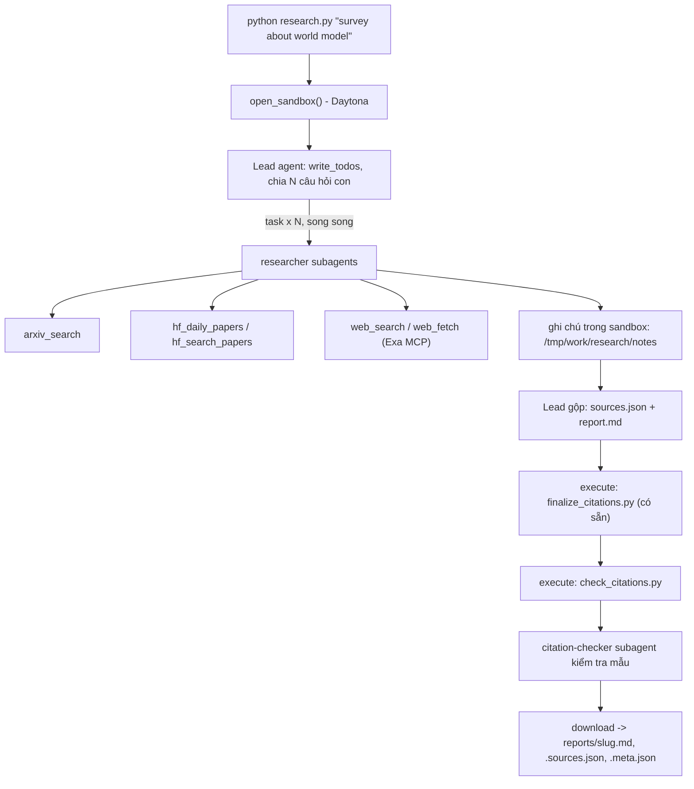

# Deep Research Agent (Deep Agents + Sandbox)

Lab dựng một **hệ thống deep research đa tác tử**: người dùng chỉ cần nhập một chủ đề (ví dụ `survey about world model`), hệ thống tự lập kế hoạch, giao việc cho nhiều subagent, tìm tài liệu trên arXiv, Hugging Face và web, rồi viết một **báo cáo có trích dẫn**.

Hình thức: **bài thực hành cá nhân**. Ngôn ngữ lập trình: Python 3.11 trở lên.

## 1. Mục tiêu học tập

Sau lab, bạn có thể:

1. Dựng agent bằng thư viện Deep Agents (LangChain): công cụ (tool), system prompt, subagent, backend.
2. Dùng **sandbox** (Daytona) làm không gian làm việc và nơi chạy mã cho agent; hiểu vì sao khóa API và công cụ mạng phải nằm ở phía host chứ không nằm trong sandbox.
3. Viết công cụ gọi API ngoài **chịu được giới hạn tốc độ** (retry, backoff, jitter, `Retry-After`).
4. Thiết kế quy trình đa tác tử: lead chia nhỏ câu hỏi, giao cho N researcher chạy song song, tổng hợp và kiểm tra trích dẫn.
5. Tạo báo cáo có thể kiểm chứng: mọi khẳng định có `[n]` trỏ tới một nguồn có thật.

## 2. Hệ thống làm gì



Nguồn dữ liệu:

| Nguồn | Dùng để |
|---|---|
| arXiv API `https://export.arxiv.org/api/query` | Tìm bài theo từ khóa, sắp theo ngày |
| Hugging Face Daily Papers `/api/daily_papers` | Bài đang "trending": upvotes, githubRepo, summary |
| Hugging Face papers search `/api/papers/search?q=` | Tìm bài theo chủ đề |
| Web qua Exa MCP (`web_search_exa`, `web_fetch_exa`) | Blog, survey, trang dự án, nội dung đầy đủ của một URL |

## 3. Cấu trúc thư mục

```
Lab/
├── README.md  GUIDE.md  RUBRIC.md  REPORT_TEMPLATE.md   tài liệu
├── topics.md                 5 chủ đề cần chạy
├── requirements.txt  .env.example  .gitignore
├── model.py                  CÓ SẴN - không sửa: tạo mô hình LLM từ biến môi trường
├── sandbox.py                CÓ SẴN - không sửa: sandbox Daytona (hoặc Docker), upload, download
├── self_check.py             CÓ SẴN - không sửa: tự kiểm tra trước khi nộp (python self_check.py)
├── finalize_citations.py     CÓ SẴN - không sửa: script chạy trong sandbox, tự sinh `## References` và đánh số lại trích dẫn
├── tools.py                  SINH VIÊN CÀI ĐẶT: retry + 5 công cụ nguồn dữ liệu
├── agents.py                 SINH VIÊN CÀI ĐẶT: prompt, subagent, lead agent
├── research.py               SINH VIÊN CÀI ĐẶT: script chính
├── check_citations.py        SINH VIÊN CÀI ĐẶT: kiểm tra trích dẫn, chạy TRONG sandbox
└── reports/                  báo cáo sinh ra (bạn commit vào repo nộp)
```

Bốn tệp "SINH VIÊN CÀI ĐẶT" đã được triển khai trong repo này. Kiểm thử offline nằm trong `tests/`; `GUIDE.md` mô tả hợp đồng và các yêu cầu gốc của bài.

## 4. Cài đặt

```bash
python3 -m venv .venv && source .venv/bin/activate      # Python 3.11+
pip install -r requirements.txt
cp .env.example .env                                     # rồi điền khóa CỦA BẠN
```

Bạn cần ba loại khóa (điền vào `.env`, **không bao giờ commit** `.env`):

| Khóa | Lấy ở đâu | Ghi chú |
|---|---|---|
| LLM (`LAB_MODEL` + khóa nhà cung cấp) | Nhà cung cấp bạn chọn (OpenAI, Anthropic, Google, OpenRouter, Ollama...) | Mô hình **phải hỗ trợ tool calling**. Chép tên mô hình từ tài liệu của nhà cung cấp. |
| `DAYTONA_API_KEY` | https://app.daytona.io | Kiểm tra gói miễn phí / credit hiện hành. Không có tài khoản hoặc hết credit: đặt `SANDBOX=docker` để chạy sandbox trong container Docker cục bộ (xem `.env.example`). |
| `EXA_API_KEY` (khuyến nghị) | https://dashboard.exa.ai/api-keys | Có thể chạy không khóa, nhưng bản miễn phí của MCP bị giới hạn tốc độ rất nhanh. |

## 5. Làm bài

### Chạy trên Windows PowerShell

```powershell
py -3.11 -m venv .venv
.\.venv\Scripts\python.exe -m pip install -r requirements.txt
if (-not (Test-Path .env)) { Copy-Item .env.example .env }
```

Điền cấu hình vào `.env` trên máy của bạn. Với endpoint tương thích OpenAI, đặt `LAB_MODEL`, `LAB_BASE_URL` và `LAB_API_KEY`. Với provider LangChain, dùng tên dạng `<provider>:<model>` và khóa tương ứng. Model cần hỗ trợ tool calling. Lượt chạy của lab này dùng `gpt-6-luna` qua endpoint riêng do người dùng cấu hình; khả năng truy cập phụ thuộc dịch vụ cung cấp endpoint.

Đặt `SANDBOX=docker` và mở Docker Desktop (Linux engine), hoặc cấu hình `DAYTONA_API_KEY` để dùng Daytona. Nên điền `EXA_API_KEY`; Exa không khóa có thể bị giới hạn rất nhanh. Không tải `.env` lên sandbox hay đưa vào Git.

```powershell
.\.venv\Scripts\python.exe -m pip check
.\.venv\Scripts\python.exe -m unittest discover -s tests -v
.\.venv\Scripts\python.exe tools.py
.\.venv\Scripts\python.exe -u research.py "survey about world model"
.\.venv\Scripts\python.exe check_citations.py reports/survey-about-world-model.md reports/survey-about-world-model.sources.json
.\.venv\Scripts\python.exe self_check.py
```

`tools.py` gọi nguồn thật; `research.py` gọi model và dùng quota/token. Test offline, validator host và `self_check.py` không gọi mạng hay model.

Chạy đủ năm chủ đề, dừng nếu một lượt thất bại:

```powershell
$topics = Get-Content topics.md | ForEach-Object {
    if ($_ -match '^\d+\. (.+)$') { $Matches[1] }
}
foreach ($topic in $topics) {
    .\.venv\Scripts\python.exe -u research.py $topic
    if ($LASTEXITCODE -ne 0) { throw "Research failed: $topic" }
}
```

Mỗi lần thành công sinh ba tệp: `.md` để đọc, `.sources.json` để đối chiếu nguồn và `.meta.json` để kiểm lần chạy. Metadata ghi số task thật, số researcher/checker, số researcher task tối đa trong cùng một AI message, tool calls và token **chỉ của lead**. Chỉ số task trong cùng message là bằng chứng giao việc trong cùng batch; không phải phép đo thời gian thực thi đồng thời. Token thiếu subagent nên không được dùng làm tổng chi phí.

Runner yêu cầu sandbox finalizer và validator thành công, ít nhất ba researcher task trong một batch, ba researcher trả kết quả thành công, một checker trả kết quả thành công và ba source tags, báo cáo có nội dung các phần và 3–5 TL;DR bullets có citation trước khi lưu nguyên bytes tải về. `successful_researcher_calls` và `successful_checker_calls` khớp task ID với ToolMessage thành công; các request lỗi vẫn nằm trong bộ đếm request nhưng không tính là kết quả thành công. Mã thoát 0 nghĩa là đạt các kiểm tra tự động; 1 là lượt lỗi; 2 là thiếu chủ đề. Kiểm tra cấu trúc không thay thế đọc nguồn để xác minh claim.

Nếu gate đầu ra từ chối, runner gửi lịch sử thật cùng lỗi đã che bí mật về lead để sửa **trong sandbox**, tối đa một lượt sửa. Lỗi hạ tầng không kích hoạt lượt sửa này. Model/tool middleware có giới hạn cho mỗi invocation; một lần chạy CLI có tối đa hai invocation của lead. Metadata cộng lịch sử trả về một lần, không nhân đôi token của lượt đầu.

Khi kiểm nguồn độc lập phát hiện lỗi nội dung, dùng phản hồi cụ thể để sinh lại toàn bộ báo cáo:

```powershell
.\.venv\Scripts\python.exe -u research.py "survey about video and multimodal generation" --review-feedback "Verify every named method against the matching primary source; remove unsupported claims."
```

Feedback chỉ bổ sung prompt, giữ nguyên chủ đề trong metadata. Các tệp báo cáo/nguồn vẫn do agent tạo, hoàn thiện và kiểm trong sandbox rồi tải về; không sửa tay trên host. Ví dụ phản hồi thật và audit nằm trong `docs/evidence/`.

Nếu arXiv trả 429 kéo dài, hệ thống có thể dùng `hf-daily`, `hf-search`, `web` đúng theo rubric. Researcher tìm Daily Papers lịch sử bằng ngày lấy từ paper đã truy xuất; nó phải ghi tag đúng công cụ và dùng các URL khác nhau sau dedup, không gán tag để đạt số lượng.

Làm theo thứ tự (chi tiết trong `GUIDE.md`):

1. `check_citations.py`: khởi động nhẹ, thuần Python.
2. `tools.py`: viết `with_retry` và 5 công cụ. Thử riêng từng công cụ: `python tools.py`.
3. `agents.py`: viết prompt, subagent và lead agent.
4. `research.py`: ghép tất cả; chạy một chủ đề:

```bash
python research.py "survey about world model"
```

Kết quả nằm ở `reports/survey-about-world-model.md` cùng `.sources.json` và `.meta.json`.

## 6. Chủ đề và nộp bài

### Kết quả local đã kiểm (09/10/2026)

Đã sinh đủ 5 bộ báo cáo bằng `gpt-6-luna` + Docker, tổng cộng 15 tệp. Cả năm đạt validator và `self_check.py`; 72 test offline đạt. Mỗi bộ có batch 3 researcher, ít nhất 3 researcher và 1 checker trả kết quả thành công, 3–4 tag nguồn thật. Kiểm nguồn độc lập và giới hạn bằng chứng nằm trong [CLAIM_AUDIT.md](docs/evidence/CLAIM_AUDIT.md); checklist từng dòng rubric trong [SUBMISSION_READINESS.md](docs/SUBMISSION_READINESS.md).

Những kết quả này đang ở checkout local trên `feature/deep-research-lab`; chưa commit/push. Repo remote là public nhưng chưa có năm bộ báo cáo trên `main`. Chỉ gọi là đã công bố sau khi kiểm độc lập đủ tệp remote.

- Chạy đủ **5 chủ đề** trong [`topics.md`](topics.md), mỗi chủ đề một lần.
- Commit mã nguồn và toàn bộ `reports/`, đẩy lên một **public repo** GitHub và nộp link.
- Kiểm tra trước khi nộp: chạy **`python self_check.py`** (không tốn token): nó kiểm tra đủ 5 báo cáo, `meta.json`, trích dẫn bằng `check_citations.py` của bạn, và không có `.env`/khóa nào trong git.
- Cách chấm: xem [`RUBRIC.md`](RUBRIC.md).

## 7. Thời gian, chi phí và an toàn

- Dùng một mô hình **rẻ nhưng hỗ trợ tool calling**, và **đặt giới hạn** (số lần gọi mô hình/công cụ cho lead và subagent, `recursion_limit`): một prompt hỏng có thể khiến agent lặp rất lâu. Đây là hạng mục 2.5 của `RUBRIC.md`.
- Kết quả có tính ngẫu nhiên: cùng một mã có thể cho báo cáo hợp lệ ở lần này và trích dẫn lỗi ở lần sau. Hãy sửa **prompt và mã**, không sửa tay báo cáo.

- Mỗi lần chạy tốn token LLM và thời gian sandbox. `tokens` trong `meta.json` chỉ đếm tin nhắn của lead, chưa gồm subagent, nên chi phí thật cao hơn. `open_sandbox()` luôn dừng và xóa sandbox khi kết thúc, kể cả khi lỗi. Đừng bỏ qua nó.
- **Không đưa bí mật vào sandbox.** Sandbox không ngăn được prompt injection hay việc đẩy dữ liệu ra mạng; một trang web độc hại có thể khiến agent chạy lệnh bên trong sandbox. Vì vậy mọi công cụ gọi mạng và mọi khóa ở lại phía host.
- Nội dung lấy từ web là **dữ liệu không đáng tin**: agent không được làm theo chỉ dẫn nằm trong đó.
